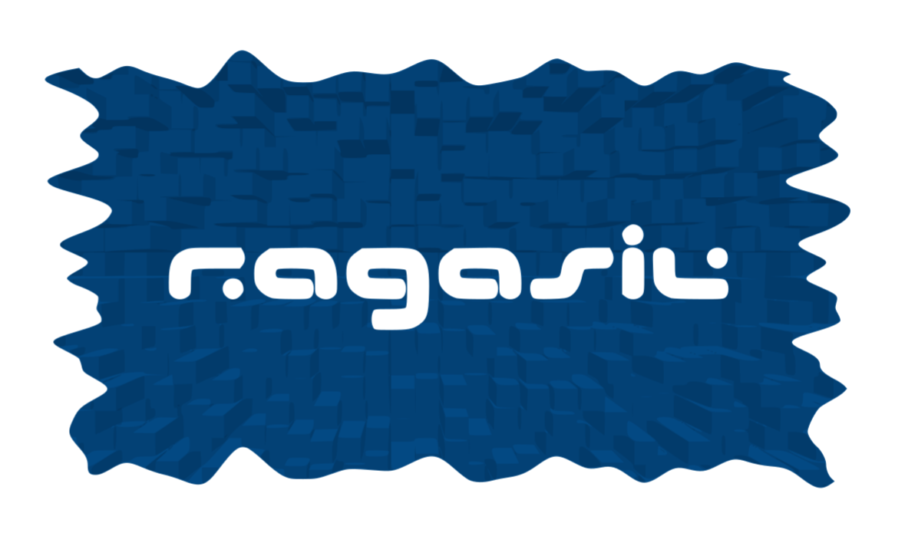

# My Professional Website

Made using [github pages](https://pages.github.com/) and the [cayman](pages-themes.github.io/cayman/) theme

## Usage

You may adapt this project as you see fit. Please feel free to reach out to me emailing [contact@ragasil.com](mailto:contact@ragasil.com) for any doubts regarding this project.

### License
This project is licensed under [CC0](./LICENSE).

## Dependencies / Set-up / Running / Deploying
You must have a [GitHub](https://github.com/) account and [create a repository](https://docs.github.com/en/repositories/creating-and-managing-repositories/creating-a-new-repository).

Please follow the guidelines at [Github Pages](https://pages.github.com/) or [Github Skills](https://skills.github.com/).
